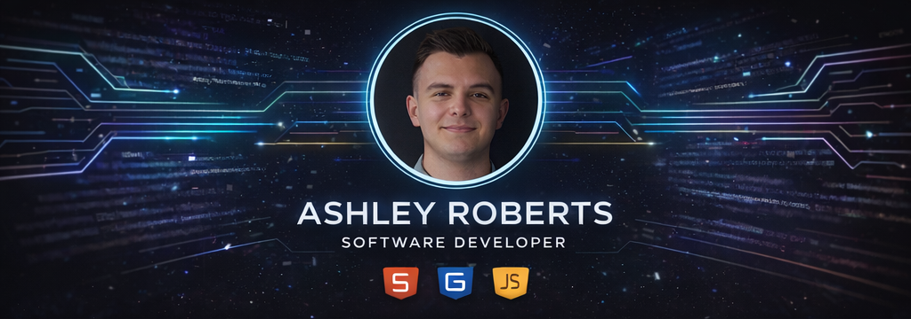

  

<h1 align="center">Hi, I'm Ashley Roberts 👋</h1>

Junior Software Developer • Web Application Development Student 

---

---

## 👨‍💻 About Me

I'm **Ashley Roberts**, based in the **UK**, currently studying a **Level 5 Diploma in Web Application Development**.

I'm passionate about **software development** and enjoy building practical, user-focused web applications. Right now I'm developing my skills in **Python, Django, and PostgreSQL** while working on my third major project, **Music Madness**.

I enjoy creating my own projects, learning new technologies, and collaborating with others to build better digital products.

---
🛠 Languages & Tools

---

## 🚀 Current Project

### 🎵 Music Madness

A community-driven **music discussion platform** where users can:

- Discover albums and artists  
- Create posts and discussions around music  
- React, comment, and engage with the community  
- Explore music genres and trending discussions

---

**Current focus:** 

Designing and building a full-stack application using **Django, PostgreSQL, and music-related APIs**.

---

## 📚 What I'm Learning

- Advanced **Django architecture**
- **API integrations**
- **Database design and optimisation**
- **Scalable web application development**
- **Python**
- **PostgreSQL**
- 

---

Thanks for visiting my profile — feel free to check out my repositories and follow my journey.

